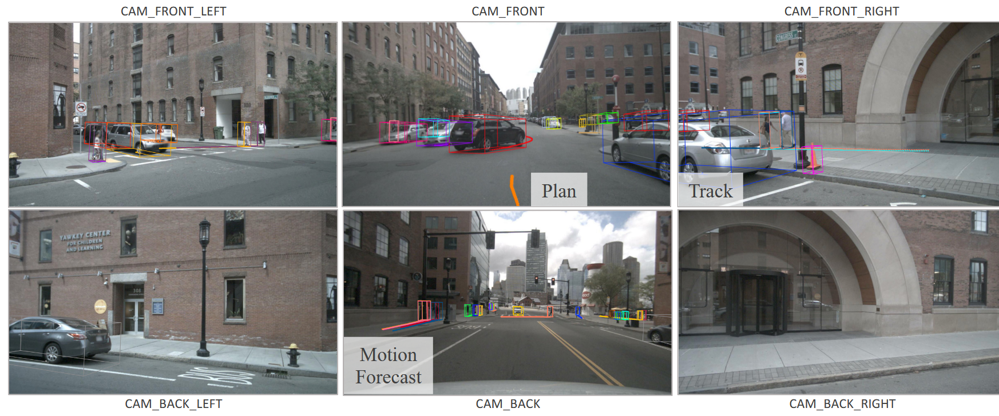

# UniAD: Planning-oriented Autonomous Driving

[开源](https://github.com/OpenDriveLab/UniAD)
[ppt](https://www.youtube.com/watch?v=cyrxJJ_nnaQ)

**UniAD：全栈可控端到端方案**，多个模块共享BEV特征的Transformer网络，将跟踪，建图，轨迹预测，Occ预测统一到一起， 并且使用不依赖高精地图的Planner 作为一个最终的目标输出，**可解耦的非黑盒的端到端可导**

**以planning为导向的自动驾驶**：不同于其他end2end。在网络中考虑到planning的整体性，而不是单纯的一步到位。**网络中包含的感知和预测的task**，都是为了最终的planning服务的。

其他方法的问题：
- 多任务框架：
  - task之间解耦, 网络之间没有相互关系
  - 不同task采用不同的head作为输出，端到端不可导
- 端到端：
  - 一步到位的黑盒，不对感知预测等任务做监督；
  - 内部有具体含义，监督感知预测，但是没有很好的联系在一起
- UniAD：多个task之间有关系，有意义，以规划为导向标的立体架构

设计关键：

- **多组查询向量的全 Transformer 模型**：UniAD多个任务共用相同的的查询Q实现了全栈 Transformer 的端到端模型，可以从具体 Transformer 的输入输出感受到信息融合。
  $Q_A,Q_M,Q_X,Q$之间相互交互，用Q来连接各个任务节点，实现各个任务之间的交互
- **以规划为导向**：全部的模块通过输出特定的特征来帮助实现最终的目标“planning”。
  eg. MotionFormer中的Q包含对整个环境的预测信息; MappingFormer中的Q包含对道路元素的抽象语义

## pipeline

BEV encoder + 4个decoder处理感知和预测 + 1个planner进行最终的规划

> hint: 这些decoder都有自己完整的架构，但是在网络交互中，一般只取最后一层注意力的Q作为网络交互输出

- **BEV**: Bird's Eye View: 将输入的多个相机视角的图像转换到到鸟瞰图特征$B$。
- **TrackFormer**：可学习的嵌入(track queries)从B查询agent信息$Q_A$，用于**检测和跟踪agent**
- **MapFormer**：从B查询道路元素的抽象语义$Q_M$（例如车道和分隔线），获取全局地图状态
- **MotionFormer**：从$Q_A, Q_M, B$捕获agent之间的交互$Q_ctx$，**联合预测**预测agent的轨迹。同时有一个自车查询能够在这种以场景为中心的范例中与其他agent进行交互。
- **OccFormer**：以$B$为查询,结合$Q_A, Q_ctx$, 在保留agent身份的情况下预测多步未来占用情况。结合上采样下采样，实现像素级的占用预测
- **Planner**：结合MotionFormer 的富有表现力的自车Q来预测规划结果 + 后端优化

**流程**：首先将**环视的图片**通过Transformer 映射到**BEV空间**。TrackFormer根据BEV信息推理，融合了检测和跟踪任务，输出为**目标检测和跟踪的信息**；MapFormer 根据BEV信息构建实时地图；接着MotionFormer 将TrackerFormer 的结果和MapFormer 的**抽象语义建图**及其BEV特征融合，输出周围agent整体轨迹和**预测**。这些信息输入OccFormer， 再次与BEV特征融合作为occupacy预测的输入。Occ的目标是数值优化中防止碰撞，规划器的输出即为整个大模型的最终**planning**输出。

## BEV

- 输入：一堆图片(can总线)
- 输出：BEV特征$B$

初始化一个Q，过一个encoder取最后一层的Q作为BEV特征$B$

## 感知部分

输出$Q_A$和$Q_M$

### TrackFormer:$Q_A$

- 输入：BEV特征$B$
- 输出：$Q_A, Q_{sdc}$

多层

由$B$**同时进行目标检测和跟踪**:每个时间步，对新感知到的agent**初始化的检测**$Q_A$，负责检测第一次感知到的新agent，$Q_A$与$B$做注意力计算。当前帧的$Q_A$再做自注意力，从而**聚合时间信息**。

### MapFormer

2D语义分割

- 输入：$B$
- 输出：$Q_M$

对于**自动驾驶场景，将车道线，分割线和十字路口设为things，并将可行驶区域设置为stuff**。

decoder堆叠N层注意力，最后一层的$Q_M$输出。

## 预测部份

对$Q_A$，$Q_M$，$B$进行查询。
$Q_{i,k}$：第i个agent的第k条预测的查询向量。以下简写为$Q$，随机初始化，经过N层迭代得到需要的。

### MotionFormer

#### 每一层的输入：Motion queries Q

MotionFormer每一层的输入Q有两部分

- 由前一层生成的查询上下文 $Q_{ctx}$
- 位置查询 $Q_{pos}$(**就是位置编码**)：位置信息四重整合(场景级锚点(全局视图中先前运动的统计量)，agent级锚点(局部坐标系的可能行为)，agent当前真实坐标， 上一层预测目标点)

$$
    Q_{pos} = MLP(PE(I^s)) + MLP(PE(I^a)) + MLP(PE(\hat x_0)) + MLP(PE(\hat x_T^{l-1}))
$$

  PE：正弦编码位置信息。

#### 每一层做什么

输出N个agent的未来T步K条可能的轨迹。三层交互：$Q_a$:agent-agent, $Q_m$:agent-map, $Q_g$:agent-goal point。

MH:多头， CA:交叉， SA:自注意力

- $Q_a$,$Q_m$

    $$
    Q_{a/m} = MHCA(MHSA(Q), Q_A / Q_M)
    $$

    上游传入的$Q$自注意力 + 和$Q_A$或$Q_M$的交叉注意力
- $Q_g$
    $$
    Q_g = DeformAttn(Q, \hat x_T^{l-1}, B)
    $$

    $DeformAttn$：可变形注意力，(上游查询，上一层预测轨迹的终点，BEV特征)：(输入查询， 参考点， 空间特征)：**围绕参考点周围的空间特征执行稀疏注意力**。预测轨迹可以根据端点周围环境进一步细化

> 传统的 Transformer 中的全局注意力机制需要计算所有位置之间的相关性，Attention 通过引入一个更加灵活的注意力机制，使得**计算注意力时更关注少数重要位置(参考点周围一小组关键点)**
> **实现**：参考点过一个小型的MLP，得到一个偏移量，偏移量和原始查询相加，得到新的查询再进行注意力计算

得到$Q_a,Q_m,Q_g$，**拼接串联后过一层MLP**（其实就是大的多头注意力），得到预测查询$Q_{ctx}$，

#### 最后输出

最后一层的输出$Q_{ctx}$，
decoder本身也可以得到最终的预测轨迹特征。

#### 加入数值优化

**loss计算中使用了数值优化平滑预测轨迹**
端到端中需要考虑向前模块带来的不确定性-->预测不精确，在还原到真实场景时会导致大曲率和加速度
**仅在训练时进行**，不影响推理

$$
\hat x^* = \arg \min_{x} c(x, \hat x)
$$

$$
c(x, \hat x) = \lambda_{xy}||x, \hat x||_2 + \lambda_{goal}||x_T,\hat x_T||_2 + \sum_{\phi \in \Phi}\phi(x)
$$

三项，其中含有真实轨迹->**仅在训练时进行**

- **轨迹和真实轨迹的偏差**
- **目标点处的偏差**
- **运动学限制**：加加速度、曲率、曲率率、加速度、横向加速度尽可能小

#### 结构

- 输入：$Q_A,Q_M,B$, 初始化最外层的$Q_{ctx}$
- 输出：$Q_{ctx}$，从中提取出的自车相关的$Q_{sdc}$

MotionFormer:

repeat:
- **Q_ctx** = MLP(**Q_ctx** , Q_pos)
- Q_a/m = MHCA(MHSA(**Q_ctx**), Q_A / Q_M)
- Q_g = DeformAttn(**Q_ctx**, x^{l-1}, B)
- **Q_ctx** = MLP([Q_a, Q_m, Q_g, Q_A])
- Q_pos = MLP(PE(I^s)) + MLP(PE(I^a)) + MLP(PE(x_0)) + MLP(PE(X^{l - 1}))

### OccFormer

Occ(decoder)输出为预测障碍物的未来`n`步栅格化地图(**像素级**)的占用情况。循环网络`n`逐步推理。

1. 稠密场景特征在展开到未来范围时，过**注意力模块**，获得agent级占用特征
2. 通过agent级特征和稠密场景特征之间的**矩阵乘法**，将占用情况映射到BEV空间，实例级(像素级)

OccFormer由$T_0$（预测范围）个序列模块构成，一般小于预测的T(计算成本高)。

#### 每一层操作

输入：

- $G_t$作为**K，V**:自前一帧的丰富的agent特征,

  $$
  G_t = MLP_t([Q_A, P_A, Q_X]), t = 1,2...,T_o
  $$

  其中$Q_A$ 上游TrackFormer的输出，$P_A$是当前位置的embending，$Q_X$是MotionFormer的$Q_{ctx}$的最大池化（$N_a * D$）
- $F_{t-1}$作为**Q**: 初始化$F_0$ 由BEV特征$B$经过**下采样到$B$的1/4得到**，减小计算消耗

每一层的操作：

$$
D^t_{ds} = MHCA(MHSA(F_{ds}^t), G_t, attn_{mask} = O^t_m)
$$

$attn_{mask} = O^t_m$：交叉注意力时用掩模只处理在时间步 t 占用像素的智能体，由$MLP(G^t)$生成 由**网络自动生成可学习掩码**

$D^t_{ds}$：为$B$的1/8，需要再**上采样到1/4**，然后和$F_{ds}^{t-1}$ **残差拼接**，得到层输出$F_{ds}^t$，传递到下一层。

#### Occ最终输出处理

- 最后一层的输出$F^{t}$ 通过**卷积解码器上采样到**像素级信息$F^{t}_{dec}\in R^{C \times H \times W}$, C类似隐藏层
- 上面由学习得到的掩模$O^t_m$ 通过另一个**MLP**更新为Occ特征$U^t \in R^{N_a \times C}$，用掩模而不是$G^t$有更优越性能

对两者做矩阵乘法即得到最终Occ，$\hat O^t_A \in R^{N_a \times H \times W}$

$$
\hat O^t_A = U^t \cdot F^{t}_{dec}
$$

#### 整体架构

- 输入：$B$, 预测信息: $Q_A$, $Q_{ctx}$
- 输出：Occ

## Planning

**两阶段**：网络生成初始解 + 数值优化

### 网络输出作为参考点

在没有高精度地图或预定义路线的情况下规划通常**需要高级命令来指示前进方向**(012)。

- 原始导航信号转换为三个可学习的embedding:**命令嵌入**(可学习)：左转，右转，直行(012)
- **规划查询**：MotionFormer的自我车辆查询已经足够表示行为，结合命令嵌入即得到规划查询
- 对$B$进行**规划查询 + 解码 + MLP**得到规划轨迹点

### 数值优化

**牛顿法+Occ**

> **hint: OccFormer得到的像素级占用信息Occ，不在网络中应用：而是在数值优化中作为避障信息使用**。

$$
\tau^* = \arg \min_{\tau} f(\tau, \hat \tau, \hat O)
$$

优化目标

$$
f(\tau, \hat \tau, \hat O) = \lambda_{occ}||\tau, \hat \tau||_2 + \lambda_{obs} \sum_{t}D(\tau_t, \hat{O^t})
$$

避障，$\hat O$为从OccFormer的实例级的预测占用合并而来的**经典二进制占用地图**

$$
D(\tau_t, \hat{O^t}) = \sum_{(x,y) \in S} \frac{1}{\sigma \sqrt{2\pi}}exp(-\frac{1}{2}(\frac{||\tau_t - (x,y)||_2^2}{\sigma})^2) \\
S = \{ (x,y) | ||(x,y) - \tau_t||_2 < d, \hat O_{x,y}^t =1 \}
$$

- **趋近于原始预测轨迹**
- **用高斯函数驱使规划路径远离S**，S由2部分决定：Occ 中被占用的像素 + 距离原始轨迹一定范围内的(加速优化过程)

## Learning

两阶段训练，训练更稳定：

1. 6和epoch训练感知部分(trackf, map)
2. 随后固定BEV(网络非常大)部分权重再用20个epoch训练预测和规划部分

由于UniAD涉及现实-网络的建模，因此在感知和预测任务中需要将预测和gt配对。对于tracking，来自检测queries的候选者与新生的gt对象匹配，来自track queries的预测继承了先前帧的分配。tracking模块中的匹配结果在motion会让occupancy节点中被重用，以在端到端的框架中对历史轨迹到未来运动的agent进行一致地建模。

## 实验

[复现视频](../video/output_video.avi)

在BVE中展示所有的结果（感知：track，建图；预测：motion，Occ；规划）:

- 感知：车和地图
- 预测：
  1. motion-预测轨迹，俯视图3条，照片1条，蓝色，0-6s，淡蓝色为概率
  2. Occ-占用像素，外面一圈和agent同颜色的
- 规划：红色，0-3s

UniAD 可以感知左前方等待的黑色车辆，预测其未来轨迹（即将左转驶入自车的车道），并立即减速以进行避让，待黑色驶离后再恢复正常速度直行。

在视野干扰较大且场景复杂的十字路口，UniAD 能通过分割模块生成十字路口的整体道路结构（如右侧 BEV图中的绿色分割结果所示），并进行大幅度左转的规划。

在夜晚视野变暗的情况下，UniAD能感知到前车并完成先静止，后左转的规划。

### Joint Results

任务协调的优势及其对规划的影响 + 消融

- 0. 每个人物单独具有头
- 1，2，3：感知部分的多模块协作
- 4，5，6：感知部分对Motion预测的影响
- 7，8，9：感知部分对Occ预测的影响
- 10，12，13：直接端到端；缺少Occ和UniAD的planning的对比

### 模块单独结果

都好

### 消融实验

都重要

### 定性结果

- 自我车辆驾驶时会注意到前方车辆和车道的潜在运动。
- 先前模块中出现不准确结果，其后面的任务仍然可以恢复(如目标的航向角误差较大或未监测到时，规划的轨迹仍然合理)。

## 未来工作

- 轻量级部署
- 结合度估计、行为预测

## 文章有啥用

本文作为第一篇全栈端到端的自动驾驶解决方案，基本上涵盖了自动驾驶的各个任务，从感知到预测到规划。

**重点在于**：以planning为终极目标，**要选用那些task作为模块**，**这些task应该怎样连接**
