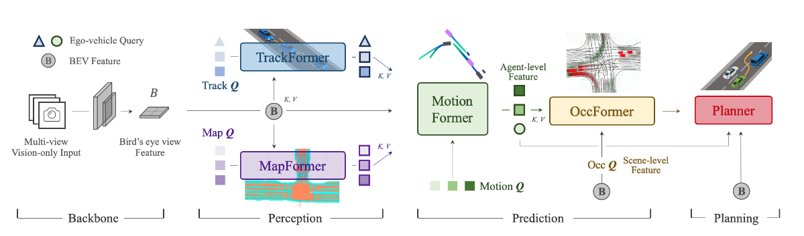

# UniAD 代码阅读



## 代码结构

### 代码目录

```shell
UniAD
├── tools
    ├──train.py
    ├──test.py
    ├──analysis
    ├──dataconvert
├── projects
    ├──configs：模型网络配置文件
    ├──mmdet3d: 3D目标检测相关
        ├──**uniad：UniAD项目相关(models)**
            ├──modules：模型网络结构
            ├──api：模型网络接口
            ├──...
        ├──其他
├──ckpts：模型训练权重
├──data：数据集

```

### 训练框架

- `tools/train.py`：训练脚本
- `tools/test.py`：测试脚本

在 `tools/uniad_dist_train.sh`中调用 `tools/train.py`进行训练，`tools/uniad_dist_eval.sh`中调用 `tools/test.py`进行测试。内部进行了输入输出，GPU等配置。

## 模型网络

`projects/configs`下有两阶段的模型网络配置文件，分别是 `stage1_track_map/base_track_map.py`和 `stage2_e2e/base_e2e.py`。

其中 `model = dict(type='UniAD', ...)`指定了模型网络的各个模块。

每个模块的具体实现在 `projects/mmdet3d_plugin`中，自己搜 `type`的值。

**UniAD本身的模型架构在 `projects/mmdet3d_plugin/uniad/detectors/uniad_e2e.py`可以看到**

下面介绍各个模块结构和输出

## Train

以下各个模块均为顺序执行

- ?: 在第一阶段和第二阶段的配置中，都是 `as_two_stage=false`，mapformer和trackformer的decoder都是用可学习的Q，不用encoder的最后一层的Q。
- `gt`：ground truth, 数据集中的真实信息

### Track Former

BEV也在其中实现

- 输入：一堆图片
- 输出：`losses_track`, `outs_track`: 包含**BEV相关**(嵌入，位置编码)；track相关(**Q_A**，匹配的索引，bbox结果)；自车相关(3d相关，track相关，**Q_sdc**)

#### 结构

1. 初始化一个空的track实例(**关键的是Q_A**)
2. 遍历历史帧图像[B, num_cam, 3, H, W]
   1. 做 `BEVFormerTrackHead`的**encoder**，生成BEV embedding 和位置编码，本质是一个encoder，输出就是最后一层的Q(**BEV**)。encoder的：
      - Q: 初始化一个可学习的Q(**BEV**)
      - K,V： img过一个embedding再处理一下(这里融合了canbus信息)
   2. 做 `BEVFormerTrackHead`的**decoder**输出(分类结果， 预测边界， 最后的参考点， **Q_A**)decoder的：
      - Q：步骤一初始化的最外层track实例的**Q_A**
      - K,V：encoder的输出 BEV embedding
   3. 处理每个decoder层的输出
   4. 使用匹配器更新track实例
3. 滚动更新num_layers次后输出 `outs_track`(从track实例中提取)和 `losses_track`

### Map Former

- 输入：BEV嵌入
- 输出：`losses_seg`, `outs_seg`: `outs_seg`是一个字典，包含了 `(outputs_classes, outputs_coords, enc_outputs_class, enc_outputs_coord, args_tuple, reference)`其中args_tuple是一个元组，包含了(**memory**, memory_mask, memory_pos, **query**, _, query_pos, hw_lvl)
  - memory相关：endcoder的每一层的输出
  - query相关：decoder的最后一层的输出 **Q_M**
  - hw_lvl：BEV的展平后的特征尺寸

#### 结构
-----------------从这里开始在forward中-----------------
1. 转换BEV为[N, C, H, W]，创建mask和位置编码
2. 初始化decoder中使用的**Q_M**(query_embeds):
   1. `as_two_stage=False`使用可学习的Q

   > `as_two_stage=True`时使用encoder的最后一层的Q，但是**第一阶段和第二阶段都不用都**
   >
3. 做 `SegDeformableTransformer`。
   1. encoder：Q_M, K, V = BEV
   2. decoder：Q_M：使用可学习的**Q_M**， K： 不需要，Attn直接由**Q_M**得到（K = **Q_M**）， V：encoder的输出feature map
4. 对输出处理，遍历每个解码层，计算分类和回归输出
----------------------forward结束---------------------
1. 计算loss

### 第二阶段的变化

- 引入 `MotionFormer`,`OccFormer`，`Planner`构成了 `UniAD`全面架构
- **冻结了BEV相关网络参数**:
  ```python
  freeze_img_backbone=True,
  freeze_img_neck=True,      #* 第二阶段冻结图像颈部网络
  freeze_bn=True,            #* 冻结BN层
  freeze_bev_encoder=True,   #****** 冻结BEV编码器
  ```
- 在第二阶段train中仍然，`as_two_stage=False`，decoder不使用encoder的最后一层的Q，而是使用可学习的Q。
- 后续的`MotionFormer`,`OccFormer`，`Planner`都只为**decoder only**，不需要encoder部分。
   > decoder only**一般用生成式结构**，decoder在Transformer架构中是**单向**的，这意味着在**生成当前词时，只能考虑之前的词，而不能看到后面的词**。这种设计非常适合生成任务。同时可以减少模型的参数量，提高模型的训练速度。

### Motion Former

MotionFormer是一个生成式的模型，用于预测轨迹，纯decoder模型。

- 输入：Q_A,Q_M,B; 一堆嵌入层；计算Q_pos的一堆MLP层 ，初始化一个Q_ctx
- 输出： 最终输出 (losses, outs_motion, track_boxes)
  outs_motion: 轨迹分数，轨迹预测，有效轨迹掩码，**Q_ctx**, Q_A, Q_A_pos, 还有**从Q_ctx中提取的自车相关的Q_sdc**

MotionFormer:
- **Q_ctx** = MLP(**Q_ctx** , Q_pos)
- Q_a/m = MHCA(MHSA(**Q_ctx**), Q_A / Q_M)
- Q_g = DeformAttn(**Q_ctx**, x^{l-1}, B)
- **Q_ctx** = MLP([Q_a, Q_m, Q_g, Q_A])
- Q_pos = MLP(PE(I^s)) + MLP(PE(I^a)) + MLP(PE(x_0)) + MLP(PE(X^{l - 1}))

> 注：Q_pos由静态和动态两部分构成，静态由最开始的embedding求的，每一层都一样，动态由每一层更新的embedding实时计算。

#### 结构

1. 提取Q_A，并将自车的Q_A提取出来拼在Q_A的后面
2. 提取Q_M
   -----------------从这里开始在forward中-----------------
3. 提取I^s, I^a x_0, x^{l-1}等信息
4. MotionFormer的前向传播
   1. 初始化**Q_ctx**
   2. 计算静态的Q_pos
   3. 遍历decoder的每一层
      1. 由上一层的输出计算动态意图嵌入 b并和静态过MLP:Q_pos = MLP(PE(I^s)) + MLP(PE(I^a)) + MLP(PE(x_0)) + MLP(PE(X^{l - 1}))
      2. **Q_ctx**和Q_A交互: Q_a = MHCA(MHSA(**Q_ctx**), Q_A) 
      3. **Q_ctx**和Q_M交互: Q_a = MHCA(MHSA(**Q_ctx**), Q_M)
      4. Q和BEV和目标点交互: Q_g = DeformAttn(**Q_ctx**, x^{l-1}, B)
      5. 融合Q_a, Q_m, Q_pos, 扩展后的原始Q_A: **Q_ctx** = MLP([Q_a, Q_m, Q_g, Q_A])
      6. 更新参考轨迹，计算4个MLP (场景级锚点，agent级锚点，agent真实坐标， 预测目标)：Q_pos中的4个
   4. MotionFormer输出每一层的**Q_ctx**和参考轨迹->outs_motion
   ----------------------forward结束---------------------
5. 计算loss(**loss计算中使用了数值优化平滑预测轨迹**？？？？？？？)
6. 从outs_motion分离自车的Q_sdc，过滤车辆查询得到最终输出

### Occ Former

在Occformer中，一个纯decoder模型，用于预测障碍物的未来`n`步占用情况，循环网络`n`逐步推理。
**在训练过程中，Occ占用不返回，只返回loss用于反向传播**

- 输入：BEV(B), 预测信息: outs_motion(Q_A, Q_ctx)
- 输出：losses_occ (**为什么不输出Occ?????**)
- 注：其中有两个掩码：注意力时的掩码

#### 结构

1. 提取future的地面真实占用情况用于算loss
2. {$G^t$}初始化G^0: G^0 = MLP_t(Q_A, Q_A_pos, pool(Q_ctx))
   -----------------从这里开始在forward中-----------------
3. {$F^t$}初始化F^0: F^0 = BEV采样->投影->下采样 1/4
4. 逐步预测future步
   1. 从outs_motion中提取Q_A, Q_ctx
   2. 逐步预测未来占用情况
      1. **F^t**: 对F^{t-1}进行下采样(卷积)  /4 -> /8
      2. **G^t**: MLP(G^t-1)
      3. 获取注意力掩码**O^t_m**, 场景级掩码**M^t** = (MLP(G^t-1))
         - cur_ins_emb_for_mask_attn = MLP(G^t)
         - attn_mask的分数 = cur_ins_emb_for_mask_attn @ F^t
         - attn_mask的分数过激活函数+和阈值比较得到二值的attn_mask：O^t_m
         - 对attn_mask进行插值上采样得到mask_pred: M^t
      4. 过n层decoder：**D^t (F^t)** = MHCA(MHSA(F^t), G^t, attn_mask = O^t_m)
      5. decoder输出D^t (F^t) 通过上采样和残差连接得到F^t： /8 -> /4
   3. 整合future步的{F^t}, {G^t}, {M^t}, {O^t_m}
5. 将F^t通过卷积decoder上采样得到像素级的 **F_dec^t**   /4 -> /1
6. **U^t** = MLP(M^t)
7. 得到最终**像素级的Occ**: **O^t_A** = U^t @ F_dec^t
   ----------------------forward结束---------------------
8. 遍历batch中的每个样本，计算loss

### Planner

**planner的输入只使用自车的Q_ctx_sdc**不用整体的Q_ctx。????????

**训练时完全不用Occ**

- 输入：BEV(B), 预测信息: outs_motion(Q_A, Q_ctx): **训练时不用Occ信息(occ_mask = None)**，规划的指令(**command，数据集里面有**)
- 输出：outs_planning: 规划结果， loss

#### 结构

1. **从outs_motion中提取自车的跟踪和预测：Q_sdc_ctx, Q_sdc_A**
-----------------从这里开始在forward中-----------------
2. 将command embedding生成导航查询Q_navi
3. 将自车轨迹跟踪和预测，以及导航查询进行拼接作为规划查询**Q_plan** = MLP([Q_sdc_ctx, Q_sdc_A, Q_navi])
4. 提取BEV
5. Q_plan + 可学习的位置编码 Q_plan = Q_plan + Q_plan_pos
6. 3层decoder Q_plan = MHCA(MHSA(Q_plan), B)
7. 提取轨迹(**训练时不用数值优化**), **sdc_traj** = 多层MLP(Q_plan)
----------------------forward结束---------------------
8. 计算loss


## Test

在test中与train有许多不同

- 不再计算loss(Motion former中的loss中的数值优化也不再有)
- 在**planner的最后结合的Occ进行数值优化**
- 地面的一些实际信息gt只用于评估
- test中需要`can_bus`信息: **逐帧预测，需要从`can_bus`中提取自车的角度和位置变化**: 也没用上？？？？？为什么要算
- 实际就是**开环训练 + 闭环测试**

以下各个模块均为顺序执行

## 数据预处理

tesk在**闭环中测试**，需要对历史数据预处理。
处理了半天也没用上历史数据`self.prev_frame_info['prev_pos']`,`self.prev_frame_info['prev_angle']` 啊??????????????????????

### 结构

1. 检查输入img和img_metas
2. 处理img和img_metas(场景切换时，**前一帧的BEV特征置0**)
3. 从canbus中获取两帧之间的**位置和角度变化量**
4. 取第一帧的img作为输入

## Track Former

- 输入：img, 上一帧的BEV特征
- 输出：BEV和Q_A相关：`["bev_embed", "bev_pos","track_query_embeddings", "track_query_matched_idxes", "track_bbox_results",
 "sdc_boxes_3d", "sdc_scores_3d", "sdc_track_scores", "sdc_track_bbox_results", "sdc_embedding"]`
   注：再过一个解码器获得真实的track结果

### 结构

和训练时的Track Former基本一样，只是没有loss计算：
img过encoder获得BEV，再过decoder获得Q_A相关的信息

## Map Former

- 输入：BEV嵌入
- 输出: Map Former分割的bbox和类别信息: `pts_bbox`: 预测的bbox, `ret_iou`: IOU结果, `args_tuple`: 网络输出Q之类的信息

### 结构

-----------------从这里开始在forward中-----------------
1. 转换BEV为[N, C, H, W]，创建mask和位置编码
2. 初始化decoder中使用的**Q_M**(query_embeds):
   1. `as_two_stage=False`使用可学习的Q

   > `as_two_stage=True`时使用encoder的最后一层的Q，但是**第一阶段和第二阶段都不用都**
   >
3. 做 `SegDeformableTransformer`。
   1. encoder：Q_M, K, V = BEV
   2. decoder：Q_M：使用可学习的**Q_M**， K： 不需要，Attn直接由**Q_M**得到（K = **Q_M**）， V：encoder的输出feature map
4. 对输出处理，遍历每个解码层，计算分类和回归输出
----------------------forward结束---------------------
5. 从输出中获取bbox,计算IOU
6. 结果存入`bbox_list`

## Motion Former 

- 输入：BEV特征，track的输出Q_A，Map的输出Q_M
- 输出：Motionformer的预测轨迹, 网络输出相关(传到下游网络中的)

### 结构

1. 提取Q_A和agent的bbox
2. 将自车的Q和Q_A融合到一起拼接到最后,提取自车的bbox
   -----------------从这里开始在forward中-----------------
3. 提取I^s, I^a x_0, x^{l-1}等信息
4. MotionFormer的前向传播
   1. 初始化**Q_ctx**
   2. 计算静态的Q_pos
   3. 遍历decoder的每一层
      1. 由上一层的输出计算动态意图嵌入 b并和静态过MLP:Q_pos = MLP(PE(I^s)) + MLP(PE(I^a)) + MLP(PE(x_0)) + MLP(PE(X^{l - 1}))
      2. **Q_ctx**和Q_A交互: Q_a = MHCA(MHSA(**Q_ctx**), Q_A) 
      3. **Q_ctx**和Q_M交互: Q_a = MHCA(MHSA(**Q_ctx**), Q_M)
      4. Q和BEV和目标点交互: Q_g = DeformAttn(**Q_ctx**, x^{l-1}, B)
      5. 融合Q_a, Q_m, Q_pos, 扩展后的原始Q_A: **Q_ctx** = MLP([Q_a, Q_m, Q_g, Q_A])
      6. 更新参考轨迹，计算4个MLP (场景级锚点，agent级锚点，agent真实坐标， 预测目标)：Q_pos中的4个
   4. MotionFormer输出每一层的**Q_ctx**和参考轨迹->outs_motion
   ----------------------forward结束---------------------
5. 从Motion网络输出和bbox中提取轨迹
6. 将自车的轨迹查询、跟踪查询和位置查询从运动输出中分离出来。
7. 输出Motionformer的预测轨迹, 网络输出相关(轨迹分数，轨迹预测，有效轨迹掩码，轨迹查询Q_ctx，跟踪查询Q_A，跟踪查询位置)

## Occ Former

- 输入：BEV特征, Motionformer的输出Qctx, Q_A，Occ_no_query: Q_A是否为空, 地面真实信息
- 输出：'seg_gt', 'ins_seg_gt': 地面实况分割和实例分割；'pred_ins_logits': Occ原始输出；'pred_ins_sigmoid': Occ预测的概率；'seg_out', 'ins_seg_out': 预测的Occ分割和实例分割

### 结构

1. 从地面实况中提取未来n步的Occ标签
   - 若Q_A为空：返回全零结果： 相当于没有Occ预测
2. {G^t}初始化G^0: G^0 = MLP_t(Q_A, Q_A_pos, pool(Q_ctx))
   -----------------从这里开始在forward中-----------------
3. {$F^t$}初始化F^0: F^0 = BEV采样->投影->下采样 1/4
4. 逐步预测future步
   1. 从outs_motion中提取Q_A, Q_ctx
   2. 逐步预测未来占用情况
      1. **F^t**: 对F^{t-1}进行下采样(卷积)  /4 -> /8
      2. **G^t**: MLP(G^t-1)
      3. 获取注意力掩码**O^t_m**, 场景级掩码**M^t** = (MLP(G^t-1))
         - cur_ins_emb_for_mask_attn = MLP(G^t)
         - attn_mask的分数 = cur_ins_emb_for_mask_attn @ F^t
         - attn_mask的分数过激活函数+和阈值比较得到二值的attn_mask：O^t_m
         - 对attn_mask进行插值上采样得到mask_pred: M^t
      4. 过n层decoder：**D^t (F^t)** = MHCA(MHSA(F^t), G^t, attn_mask = O^t_m)
      5. decoder输出D^t (F^t) 通过上采样和残差连接得到F^t： /8 -> /4
   3. 整合future步的{F^t}, {G^t}, {M^t}, {O^t_m}
5. 将F^t通过卷积decoder上采样得到像素级的 **F_dec^t**   /4 -> /1
6. **U^t** = MLP(M^t)
7. 得到最终**像素级的Occ**: **O^t_A** = U^t @ F_dec^t
   ----------------------forward结束---------------------
8. 取未来n步的Occ，过激活函数转化为概率 O^t_A_sigmoid = sigmoid(O^t_A)，获得**Occ预测的概率**
9. ? 用track score对Occ进行加权: track_scores * Occ：track_scores为1或0, **只关注track置信度高的Occ**
10. 阈值化得到Occ分割，大于阈值为1，小于阈值为0。获得**二值化的Occ分割**
11. 评估时是否进行实例分割，默认为True
12. 输出

## Planner

**planner的输入只使用自车的Q_ctx_sdc**不用整体的Q_ctx。????

- 输入：BEV特征，Motionformer的输出Qctx, Q_A，**Occ**，gt的规划信息，规划指令
- 输出：规划最终轨迹

### 结构

1. **提取自车的轨迹跟踪和预测： Q_sdc_ctx, Q_sdc_A**，提取BEV和Occ(二值化)
-----------------从这里开始在forward中-----------------
2. 将command embedding生成导航查询Q_navi
3. 将自车轨迹跟踪和预测，以及导航查询进行拼接作为规划查询Q_plan = MLP([Q_sdc_ctx, Q_sdc_A, Q_navi])
4. 提取BEV
5. Q_plan + 可学习的位置编码 Q_plan = Q_plan + Q_plan_pos
6. 3层decoder Q_plan = MHCA(MHSA(Q_plan), B)
7. 提取轨迹(**训练时不用数值优化**), sdc_traj = 多层MLP(Q_plan)
8. **相较于train加一层数值优化**
----------------------forward结束---------------------

## 最终输出一个result

`result`为一个list，**每个元素是一帧的输出的字典**，用`token`字段标记，**用于后续的评估**

评估后数据分析详见[数据分析](../../tools/data_analyze/数据分析.ipynb)

- `token`：帧的标记
-  **track_former**:  {"bev_embed", "bev_pos","track_query_embeddings", "track_query_matched_idxes", "track_bbox_results", "sdc_boxes_3d", "sdc_scores_3d", "sdc_track_scores", "sdc_track_bbox_results", "sdc_embedding"}
-  **map_former**: {"pts_bbox", "ret_iou", "args_tuple"}
-  **motion_former**: traj_results：最终轨迹
-  **occ_former**: {"seg_gt", "ins_seg_gt", "pred_ins_logits", "pred_ins_sigmoid", "seg_out", "ins_seg_out"}
-  **planner**：{'planning_gt', 'result_planning'}